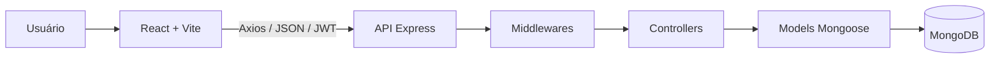
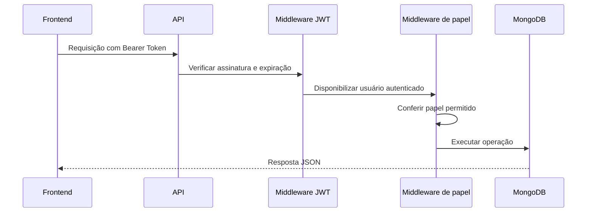

<div align="center">

# 🦷 Clínica OdontoVida

### Sistema full-stack para gestão de uma clínica odontológica

[](https://react.dev/)
[](https://nodejs.org/)
[](https://expressjs.com/)
[](https://www.mongodb.com/)
[](https://vite.dev/)

Projeto de portfólio desenvolvido para praticar a construção de uma aplicação completa, com frontend, API REST, banco de dados, autenticação e regras reais de negócio.

</div>

---

## 📌 Sobre o projeto

A **Clínica OdontoVida** é uma aplicação web para apoiar a rotina de uma clínica odontológica fictícia. O sistema permite administrar pacientes, profissionais, consultas e usuários, respeitando diferentes níveis de acesso.

O projeto foi construído com frontend e backend separados. O React consome uma API REST desenvolvida com Express, que aplica as regras de negócio e persiste os dados no MongoDB.

> Este é um projeto educacional e não deve ser utilizado para armazenar dados clínicos reais sem uma revisão completa de segurança, privacidade e conformidade legal.

## ✨ Funcionalidades

### Autenticação e usuários

- Login com JSON Web Token (JWT)
- Sessão com duração de 8 horas
- Tratamento global de sessão expirada
- Rotas protegidas no frontend e na API
- Controle de acesso por papel
- Cadastro, edição e desativação lógica de usuários
- Troca de senha exclusiva para administradores
- Vinculação entre usuário dentista e profissional

### Pacientes

- Listagem de pacientes ativos
- Cadastro e edição
- Máscara de telefone
- Histórico e observações
- Desativação lógica com confirmação visual

### Profissionais

- Listagem de profissionais ativos
- Cadastro e edição
- Especialidade e telefone
- Quantidade de consultas ativas
- Desativação lógica

### Agenda

- Listagem de consultas ativas
- Filtros por paciente, profissional, status e data
- Criação e edição de consultas
- Confirmação, conclusão e cancelamento
- Modal reutilizável para ações importantes
- Exibição somente de horários disponíveis

### Dashboard e histórico

- Indicadores de consultas, pacientes e profissionais
- Próximos atendimentos
- Atalhos conforme o papel do usuário
- Histórico completo de consultas
- Pesquisa sem diferença entre maiúsculas, minúsculas e acentos
- Filtros por profissional, status e período

## 👥 Papéis e permissões

| Funcionalidade | Admin | Recepcionista | Dentista |
|---|:---:|:---:|:---:|
| Visualizar dashboard e agenda | ✅ | ✅ | ✅ |
| Visualizar pacientes e profissionais | ✅ | ✅ | ✅ |
| Criar e editar consultas | ✅ | ✅ | ❌ |
| Confirmar, concluir ou cancelar consultas | ✅ | ✅ | ❌ |
| Gerenciar pacientes e profissionais | ✅ | ✅ | ❌ |
| Criar recepcionistas e dentistas | ✅ | ✅ | ❌ |
| Criar ou editar administradores | ✅ | ❌ | ❌ |
| Alterar senhas de usuários | ✅ | ❌ | ❌ |

As permissões visuais melhoram a experiência, mas a autorização definitiva é aplicada pela API.

## 🕐 Regras de agendamento

- Cada consulta possui duração de **1 hora**
- Atendimento de **segunda a sexta-feira**
- Expediente das **09:00 às 18:00**
- Último início permitido às **17:00**
- Intervalo de almoço das **12:00 às 13:00**
- Um profissional não pode ter consultas sobrepostas
- Consultas canceladas não bloqueiam novos horários
- A tela de cadastro mostra apenas horários disponíveis

Exemplo: uma consulta iniciada às `15:35` ocupa o profissional até `16:35`. Outra consulta poderá começar exatamente às `16:35`.

## 🧰 Tecnologias

### Frontend

- React 19
- Vite
- React Router DOM
- Axios
- styled-components
- Context API
- ESLint

### Backend

- Node.js
- Express 5
- MongoDB
- Mongoose
- JSON Web Token
- bcryptjs
- CORS
- dotenv
- Nodemon

## 🏗️ Arquitetura



### Fluxo de uma requisição protegida



## 📁 Estrutura de pastas

```text
clinica-odontovida/
├── clinica-odontovida-api/
│   ├── src/
│   │   ├── config/
│   │   ├── controllers/
│   │   ├── middlewares/
│   │   ├── models/
│   │   ├── routes/
│   │   └── app.js
│   ├── .env.example
│   ├── package.json
│   └── server.js
│
├── clinica-odontovida-web/
│   ├── src/
│   │   ├── api/
│   │   ├── components/
│   │   ├── contexts/
│   │   ├── pages/
│   │   ├── routes/
│   │   └── utils/
│   ├── .env.example
│   └── package.json
│
└── README.md
```

## 🚀 Como executar

### Pré-requisitos

- Node.js instalado
- npm
- MongoDB local ou MongoDB Atlas

### 1. Clone o repositório

```bash
git clone URL_DO_SEU_REPOSITORIO
cd clinica-odontovida
```

### 2. Configure e execute a API

```bash
cd clinica-odontovida-api
npm install
```

Copie `.env.example` para `.env` e preencha:

```env
PORT=3000
MONGODB_URI=sua_conexao_com_o_mongodb
JWT_SECRET=uma_chave_secreta_forte
```

Inicie a API:

```bash
npm run dev
```

### 3. Configure e execute o frontend

Em outro terminal:

```bash
cd clinica-odontovida-web
npm install
```

Copie `.env.example` para `.env`:

```env
VITE_API_URL=http://localhost:3000/api
```

Inicie o frontend:

```bash
npm run dev
```

O Vite mostrará no terminal o endereço local da aplicação.

## 🔐 Variáveis de ambiente

Arquivos `.env` não devem ser enviados ao GitHub. Somente os arquivos `.env.example`, sem valores reais, fazem parte do projeto.

| Aplicação | Variável | Descrição |
|---|---|---|
| API | `PORT` | Porta do servidor Express |
| API | `MONGODB_URI` | String de conexão com o MongoDB |
| API | `JWT_SECRET` | Chave usada para assinar os tokens |
| Web | `VITE_API_URL` | Endereço base da API |

## ✅ Verificações disponíveis

Frontend:

```bash
npm run lint
npm run build
```

API:

```bash
node --check server.js
```

> O projeto ainda não possui testes automatizados. Essa é uma das próximas evoluções planejadas.

## ⚠️ Limitações conhecidas

Este é um projeto acadêmico e de portfólio. A versão atual possui limitações que fazem parte do plano de evolução:

- Ainda não há testes automatizados para a API ou para o frontend.
- A verificação de conflito de horários não impede completamente duas reservas simultâneas enviadas no mesmo instante.
- Algumas regras de agendamento existem no frontend e no backend e precisam permanecer sincronizadas.
- As listagens ainda carregam todos os registros, sem paginação no servidor.
- O controle de acesso pode ser refinado para restringir quais pacientes e consultas cada dentista visualiza.
- Modais e formulários ainda podem receber melhorias de acessibilidade, como gerenciamento de foco e navegação completa por teclado.
- O sistema não possui recuperação de senha, renovação de token ou revogação imediata da sessão quando o papel do usuário é alterado.
- A aplicação ainda não passou por testes de carga nem por preparação completa para uso em produção.

## 🗺️ Próximas melhorias

- Testes automatizados para API e frontend
- Endpoint específico de disponibilidade
- Paginação das listagens e do histórico
- Validação centralizada dos dados recebidos
- Tratamento centralizado de erros da API
- Revogação de tokens após desativação ou troca de papel
- Proteção contra reservas simultâneas concorrentes
- Documentação da API com OpenAPI/Swagger
- Deploy do frontend e backend

## 🎓 Aprendizados

Durante o desenvolvimento foram praticados:

- Comunicação entre frontend e API REST
- Autenticação e autorização
- Modelagem com MongoDB e Mongoose
- Regras de negócio de agendamento
- Estado, effects e dados derivados no React
- Componentização e estilização responsiva
- Tratamento de erros e experiência do usuário
- Uso responsável de IA como apoio para planejamento, implementação, revisão e estudo do código

## 👨‍💻 Autor

Desenvolvido como projeto de estudo e portfólio por **Matheus**.

Se este projeto foi útil ou chamou sua atenção, deixe uma ⭐ no repositório.
